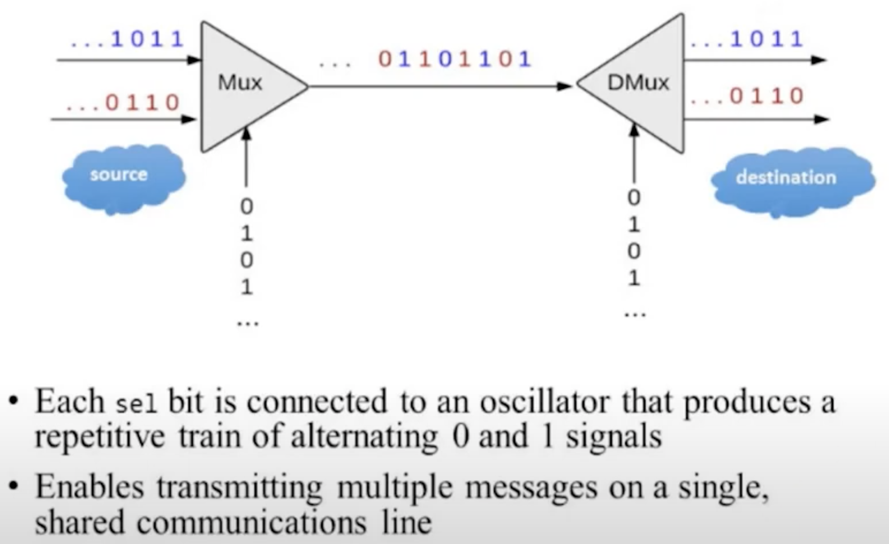
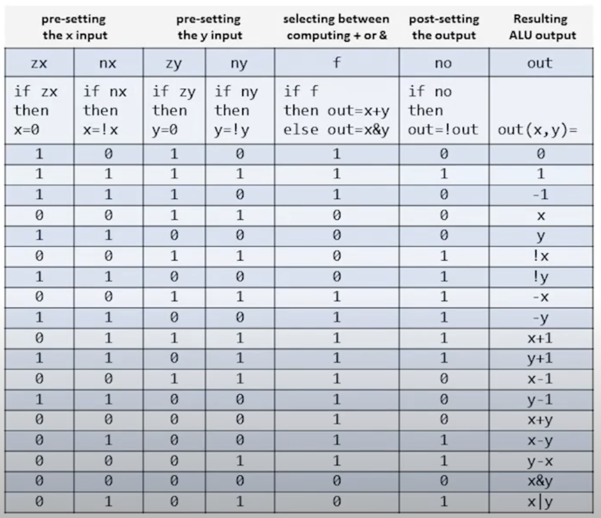
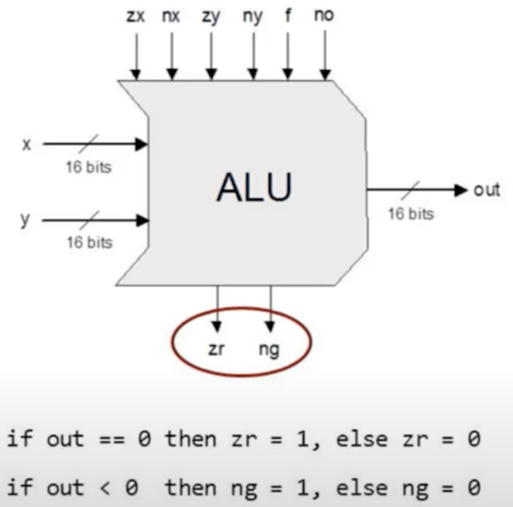
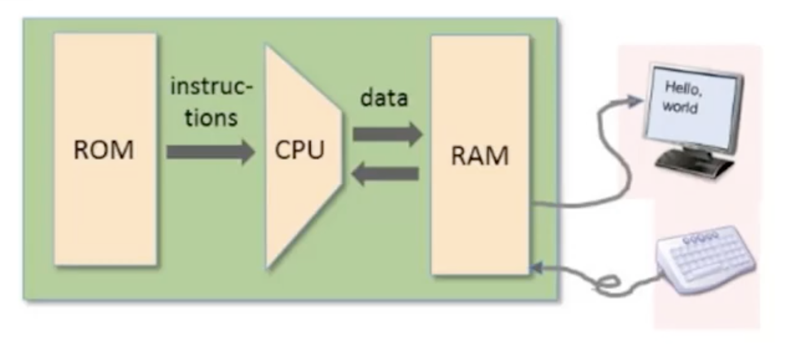
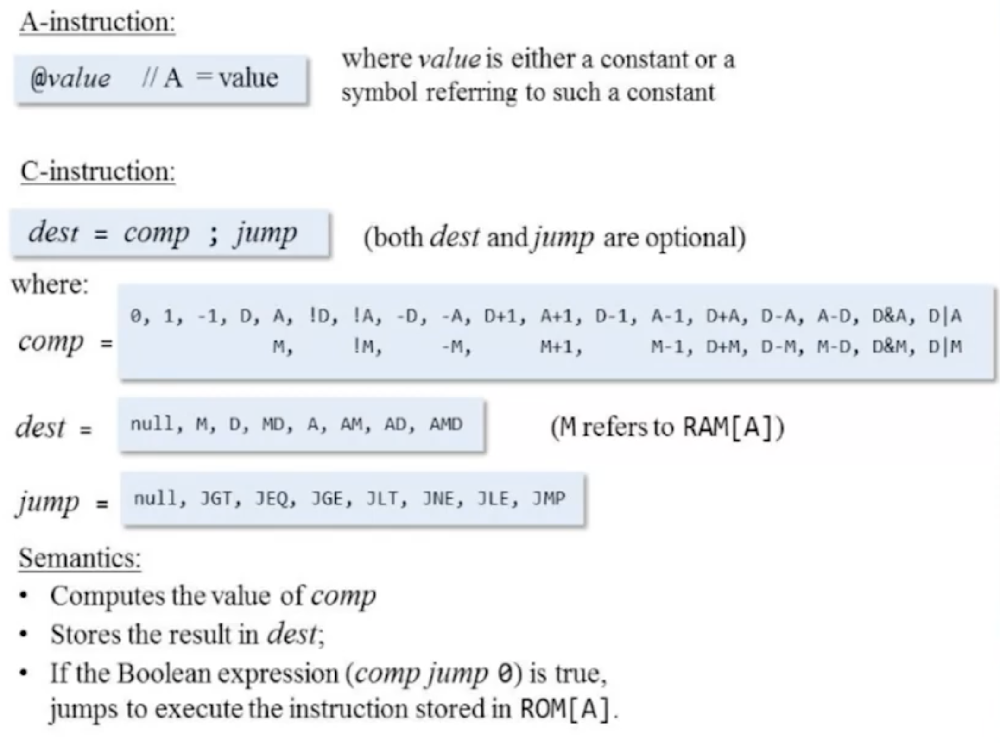

# Hack Computer

Hack is a 16-bit computer designed for the [nand2tetris](https://www.nand2tetris.org/) course, which is meant to be simple but Turing complete.

[More about Hack computer](https://en.wikipedia.org/wiki/Hack_computer)

# Hardware
This section is aimed at creating the bare-bones of the computer. First, we create simple logic gates, and then use them to further create more complex hardware. The logic is written in a special Hardware Description Language (HDL) specified [here](https://docs.wixstatic.com/ugd/44046b_2cc5aac034ae49f4bf1650a3d31df32c.pdf).

## Logic Gates
All logic gates are created from the primitive NAND gate. Here is a list of gates that have been implemented:
 - **Basic**: Nand, Not, And, Or, Xor, Mux, DMux
 - **Multi-Bit:** Not16, And16, Or16, Mux16
 - **Multi-Way:** Or8Way, Mux4Way16, Mux8Way16, DMux4Way, DMux8Way

Example of multiplexing / demultiplexing in communications networks

## Arithmetic
ALU (Arithmetic Logic Unit) can compute eighteen functions using a minimal hardware design. It uses 6 control bits, where each bit corresponds to a specific elementary operation.

The following functions can be calculated using the control bits as follows:

ALU also outputs two status bits.

The following chips are implemented in this section:
 - HalfAdder, FullAdder, Add16, Inc16, ALU

## Registers, RAM and PC
Storage is implemented using data flip-flops (DFF) and sequential logic. DFF implements out[t] = in[t-1]. The registers are 16 bits wide and consist of DFFs. These registers then combined to create random access memory (RAM). It allows data to be read/written from/to any address in constant time, regardless of physical location.

Finally, the program counter is also implemented using a 16-bit register, which has the following functions: reset to zero, load a specific value, and increment the current value.

List of implemented chips:
- Bit, Register
- RAM8, RAM64, RAM512, RAM4K, RAM16K
- PC

# Architecture
Bringing together all the circuitry, the computer is assembled in this section. The resulting device is a 16-bit von Neumann platform consisting of a CPU, two memory modules, and two memory-mapped I/O devices - a screen and a keyboard.

There are two 16-bit registers A and D, where D is a data register that is designed to store values, and A provides direct memory access.

Hack computer architecture:

## Instruction Set
There are two generic types of instructions available - A-instructions or address instructions, and C-instructions or compute instructions. Each instruction has a binary and symbolic representation.

Examples of projects using these instructions:
- Mult, Fill

## Memory
This computer has two memory banks, instruction memory and data memory. The instruction memory is implemented using a ROM chip with 32K addressable 16-bit registers. The data memory is a RAM device consisting of 32K addressable 16-bit registers with the ability to map I/O to memory.

The data memory is organized with the RAM at the top, followed by I/O memory buffers for two peripherals, the 512 x 256 display and the keyboard. The data memory supports 15-bit addressing.
<table>
	<thead>
		<tr>
			<th> address </th>
			<th> component </th>
			<th> capacity </th>
		</tr>
	</thead>
	<tbody>
		<tr>
			<td>
0x0000   -   0x3FFF
</td>
			<td>RAM </td>
			<td> 16K </td>
		</tr>
		<tr>
			<td>
0x4000   -   0x5FFF 
</td>
			<td> Screen </td>
			<td> 8K </td>
		</tr>
		<tr>
			<td>0x6000</td>
			<td> Keyboard </td>
			<td> 1 </td>
		</tr>
	</tbody>
</table>
